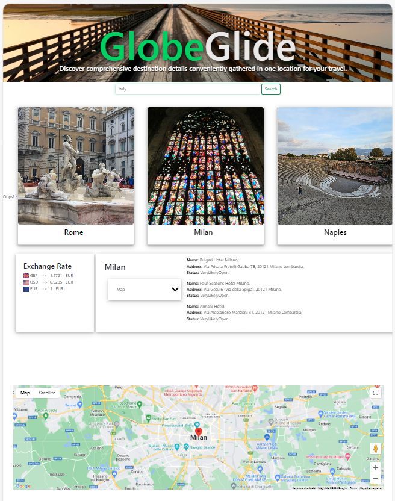

# GlobeGlide

## Description

The [GlobeGlide](https://foroughgoudarzi.github.io/GlobeGlide/) application is designed to be accessed via web browsers, offering dynamically updated HTML and CSS for an engaging user experience. Leveraging various Web APIs, this application provides valuable information for travelers exploring different countries.

The following Web APIs have been used to fetch data.

1. [API Ninjas](https://api-ninjas.com/): Using a country name, the country two-letter ISO code and the three-letter currency code is fetched from API Ninjas. Then by utilizing the country's two-letter ISO code, three popular cities in the country and their coordinates are fetched from API Ninjas.

2. [ExchangeRate-API](https://www.exchangerate-api.com/): Using the fetched country currency code obtained from API Ninjas, three query is made to Exchange-Rate API to optain exchange rate to "GBP", "USD" and "EUR".

3. [FOURSQUARE Places API](https://location.foursquare.com/developer/reference/places-api-overview):  Using city coordinates obtained earlier, this API retrieves points of interest, such as monuments, hotels, etc along with their photo codes (`fsq_id`). Then with this code, the application fetches the respective photo URLs.

4. [Google Maps Geocoder API](https://developers.google.com/maps/documentation/javascript/reference/geocoder): This API facilitates the retrieval of city maps to enhance the user experience.

The following figure shows a screenshot of the working API.

<figure>

<figcaption><em>Figure.1. GlobeGlide application</em></figcaption>
</figure>

### How it works

1. The user inputs a country name and initiates the search.
2. GlobeGlide displays names of three popular cities within the selected country and presents the exchange rates for its currency.
3. Clicking on a city image reveals a dropdown menu, allowing users to select points of interest and view corresponding information as well as the city map.
4. The application stores the information (name, two-letter ISO code and three-letter currency code) of the last ten searched countries in the local storage for quicker information retrieval.

## Installation

N/A

## Credits

The following resources were used.

* [API Ninjas](https://api-ninjas.com/) documentation.
* [ExchangeRate-API](https://www.exchangerate-api.com/) documentation.
* [FOURSQUARE Places API](https://location.foursquare.com/developer/reference/places-api-overview) documentation.
* [Google Maps Geocoder API](https://developers.google.com/maps/documentation/javascript/reference/geocoder) documentation.
* https://www.w3schools.com/
* https://developer.mozilla.org/
* https://stackoverflow.com/

## License

Please see the [License](./License)
